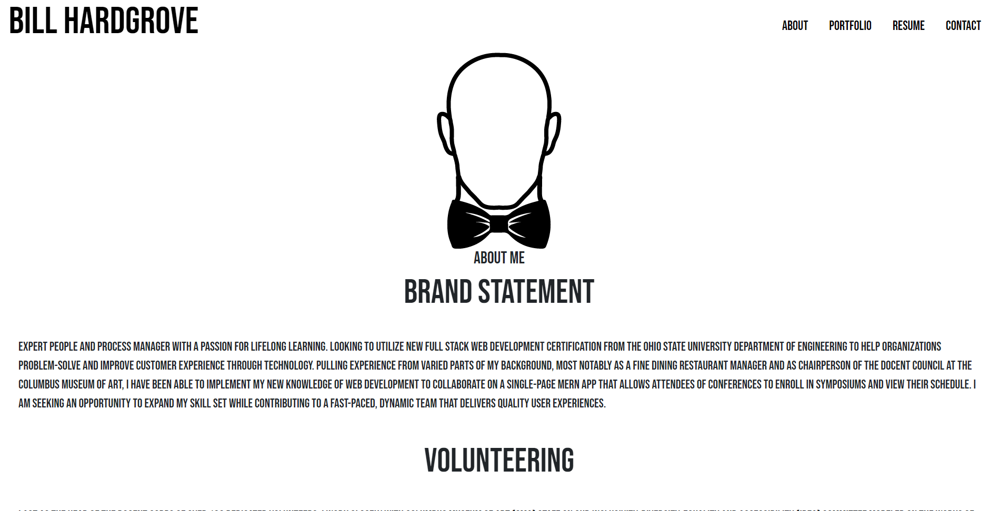

# Bill Hardgrove Portfolio
---
  
  ## Description 
  A portfolio of my experience, what drives me and how to get in contact.
  
  
  ## Table of Contents
  * [License](#license)
  * [Usage](#usage)
  * [Tests](#tests)
  * [Repo](#repo)
  * [URL](#url)
  * [Questions](#questions)
  
 
  ## License 
  This project is license under MIT

 
  ## Usage
  To launch... type ```NPM start``` in your terminal while using code

  ## Tests
  No tests written
  

  ## Repo
  The Github repo is https://github.com/WmHHardgrove/BillHardgrovePortfolio

  ##  URL
 


  ## Questions
  If you have any questions about this projects, please contact me directly at Wmhhardgroveiv@gmail.com. You can view more of my projects at https://github.com/WmHHardgrove.